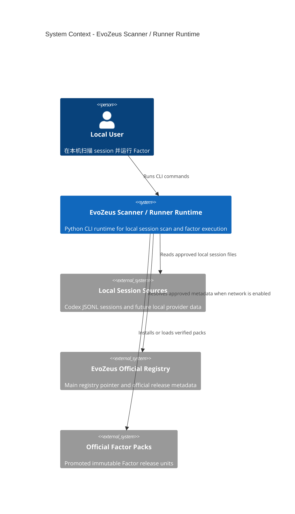
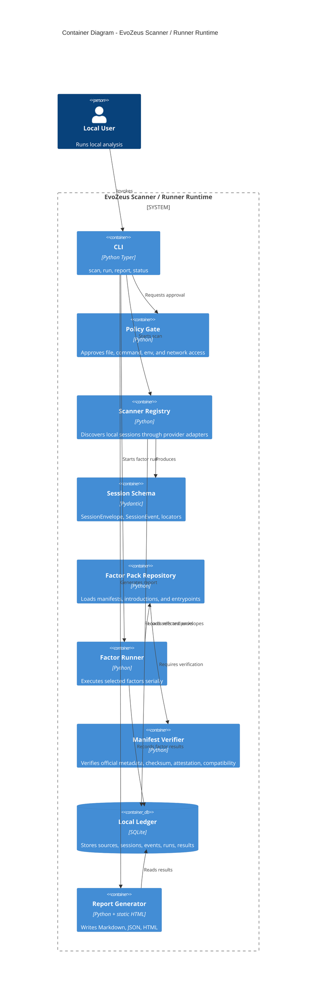

# EvoZeus Scanner / Runner Runtime Design

- Status: proposed
- Date: 2026-06-19
- Owner: EvoZeus infra / runtime
- Language: 中文为主，保留必要英文专有名词

## 1. 背景

当前 repo 同时存在两套东西：

1. 根目录 JS `infra` shell：`src/infra.mjs`、`scripts/*.mjs`、`tests/*.mjs`，主要是 probe、doctor、install-plan validator 和 hardcoded smoke。
2. `prototypes/main-repo-runtime/__infra__/`：旧 Python runtime prototype，已经实现 scanner、factor runner、SQLite result store、report、CLI、TUI、companion 和测试。

按照当前讨论，本 repo 不应继续定位成泛化的 future infra shell。它应该明确成为：

```text
EvoZeus local scanner / runner runtime
```

它的核心职责是扫描本地 session、标准化为 `SessionEnvelope`、执行被选择的 Factor、写入本地 ledger、生成本地 report。不是默认上传工具，不是 factor marketplace，不是主 registry 治理 repo，也不是未审 factor 的安装源。

## 2. 核心决策

### 2.1 统一语言

P0 统一使用 **Python**。

理由：

- 现有真正可运行的 scanner / runner prototype 已经是 Python。
- Scanner 的主要工作是本地文件发现、JSONL 解析、locator、fingerprint、SQLite 写入，Python 足够直接。
- Runner 需要承接 Factor 作者生态、文本规则、可能的 NLP / LLM 辅助分析，Python 更适合快速迭代。
- CLI 使用 Typer，TUI 使用 Textual，local API 使用 FastAPI，SQLite 使用标准库和轻量封装即可。
- JS/TS 只允许出现在生成的 HTML report 前端资产里，不进入核心执行层。

### 2.2 根目录 JS shell 处理

根目录 JS shell 不是 scanner/runner runtime。它混合了 probe、contract stub 和假 registry metadata，容易制造“组件可用”的错觉。

处理方式：删除。

```text
delete:
  package.json
  src/infra.mjs
  scripts/evozeus-infra-doctor.mjs
  scripts/validate-infra-install-plan.mjs
  tests/infra-components.test.mjs
  tests/infra-doctor.test.mjs
  tests/infra-install-plan.test.mjs
```

其中 install plan validator 的约束不是丢弃，而是迁移进 Python `policy/` 和 `registry/` 模块。

### 2.3 Prototype 处理

`prototypes/main-repo-runtime/__infra__` 不是最终路径，但其中有可保留的核心设计：

- Scanner Adapter + Registry
- Factor Abstract Base Class + Template Method
- Runner Serial Pipeline
- Runtime Strategy / Resolver
- Storage Repository
- Report Repository

处理方式：迁移核心代码到根目录正式 Python package，并重命名、拆边界、补测试。旧 prototype 目录在迁移完成后删除。

## 3. 目标与非目标

### 3.1 P0 目标

- 提供可安装 Python package。
- 提供 CLI：`scan`、`run`、`report`、`status`。
- 支持 Codex 本地 session scanner。
- 输出统一 `SessionEnvelope` 和 `SessionEvent`。
- 支持从本地已验证 FactorPack 加载并执行 factor。
- 支持 in-process factor runtime。
- 支持 subprocess factor runtime，并带 timeout、stdout JSON result 校验、依赖锁文件检查。
- 写入 `.evozeus/runtime/index/results.sqlite3` 或最终统一后的 `.evozeus/infra/index/results.sqlite3`。
- 生成 Markdown / JSON / HTML report。
- 所有文件读取、文件写入、外部命令、网络访问都经过 policy gate。
- 测试以 contract / integration / golden fixture 为主，不再使用 smoke 测试作为质量标准。

### 3.2 P0 非目标

- 不做默认全盘扫描。
- 不默认联网。
- 不默认上传 raw session。
- 不直接安装 lab branch 或未审 factor。
- 不做 factor marketplace。
- 不做完整 GUI。
- 不把 TUI / companion 作为 P0 必须路径。
- 不保留 JS core runtime。

## 4. C4 Context



## 5. C4 Container



## 6. 模块设计

### 6.1 CLI

职责：

- 解析命令参数。
- 构造 use case。
- 显示结果路径和拒绝原因。
- 不直接解析 session、不直接跑 factor、不直接写 SQLite。

P0 命令：

```text
evozeus-runtime status
evozeus-runtime scan --provider codex --workspace <path>
evozeus-runtime scan --provider codex --source <path> --workspace <path>
evozeus-runtime run --session-id <id> --factor <factor_id> --workspace <path>
evozeus-runtime report --session-id <id> --workspace <path> --format markdown|json|html
```

`--source` 是可选参数。不传时，scanner 使用 provider adapter 声明的默认本地目录；Codex P0 默认目录是 `~/.codex/sessions` 和 `~/.codex/archived_sessions`。

### 6.2 Policy Gate

职责：

- 声明本次操作要读取哪些路径。
- 声明要写入哪些路径。
- 声明会读取哪些 env var。
- 声明会运行哪些外部命令。
- 声明是否联网。
- 在未授权时返回结构化拒绝原因。

P0 可以从 CLI flag 或 config 获取 approval。默认拒绝 network、external commands、workspace 外写入。

### 6.3 Scanner

设计模式：Abstract Base Class + Adapter + Registry。

Scanner 要兼顾不同本地应用的 session 格式，但不能让 provider 私有格式扩散到 runner、ledger、report 或 factor。每个应用作为一个 provider adapter：

- `CodexScanner` 解析 Codex 本地 JSONL session。
- 后续 `ClaudeCodeScanner`、`CursorScanner`、`FeishuScanner` 等 scanner 只新增 adapter，不改 runner / factor contract。
- Registry 负责按 `provider` 路由；`provider="auto"` 时通过 `can_discover()` 做能力匹配。
- Adapter 必须声明 `source_dirs()`，让 permission gate 可以在 discover/load 前知道将读取哪些本地目录。
- `scan` 阶段只发现并记录 `session_id` 和 `message_id`，不写入 message content、tool output 或 preview。
- `sessions` 表必须把 `project_key` / `project_label` 提成一等字段，不能只藏在 `metadata_json`。
- SQLite 的 `session_events` 在 scan 后只是 message id index，用于把后续 Factor evidence、tags、results 挂回对应 message。
- `iter_events(ref)` 必须用 generator 渐进式读取原始 session，不能一次性读完整文件。
- `load` 阶段通过消费 `iter_events(ref)` materialize `SessionEnvelope`，并携带 `scanner_id`、`scanner_version`、locator 和 source fingerprint。

接口：

```python
class SessionScanner(ABC):
    provider: str

    def source_dirs(self, request: ScanRequest) -> list[Path]: ...
    def can_discover(self, request: ScanRequest) -> bool: ...
    def discover(self, request: ScanRequest) -> list[SessionRef]: ...
    def discover_message_refs(self, ref: SessionRef) -> list[SessionMessageRef]: ...
    def iter_events(self, ref: SessionRef) -> Iterator[SessionEvent]: ...
    def load(self, ref: SessionRef) -> SessionEnvelope: ...
```

P0 scanner：

- `CodexScanner`
- 输入：Codex JSONL session 或 source-id manifest。
- scan 输出：`SessionRef` 和 `SessionMessageRef`。
- load 输出：`SessionEnvelope`。
- 必须保留 source locator、source fingerprint、raw line index、event index。
- 必须 redaction secret preview，不能把 secret 写入 report preview。

### 6.4 Sessions

职责：

- 定义 `SessionEnvelope`、`SessionEvent`、`EventLocator`、`ResolvedEvent`。
- 给 scanner、runner、ledger、report 提供唯一数据 contract。

规则：

- 所有 factor 只读 `SessionEnvelope`，不能直接读 provider 原始文件。
- 原始文件定位通过 locator 还原。
- `SessionEnvelope` schema version 必须显式写入。

### 6.5 Factor

设计模式：Abstract Base Class + Template Method。

规则：

- `Factor.execute()` 固定通用流程。
- factor 作者只实现 `run()`。
- execute 补齐 `factor_id`、`factor_version`、`session_id`。
- factor 返回值必须通过 `FactorResult` schema 校验。

### 6.6 Factor Pack Repository

职责：

- 发现 pack。
- 加载 manifest。
- 加载 introduction。
- 校验 `FACTOR.xml` 和 `factor.json` 一致。
- 解析 entrypoint。

P0 只支持本地已验证 pack root。官方 registry consumer 可以在 P1 接入，但 manifest verifier 的接口在 P0 建好。

### 6.7 Runner

设计模式：Serial Pipeline + Runtime Strategy。

规则：

- `FactorRunner` 串行执行 selected factors。
- 单个 factor 报错记录 `FactorRunError`，不中断后续 factor。
- runner 不扫描 session。
- runner 不写 report。
- runner 只返回 `FactorRunSummary`。

Runtime strategy：

- `InProcessRuntime`
- `SubprocessUvRuntime`

P0 默认 in-process，subprocess 支持 timeout 和 result JSON 校验。

### 6.8 Ledger

设计模式：Repository Pattern。

职责：

- 保存 source refs。
- 保存 session envelope 摘要和 events。
- 保存 installed factor metadata。
- 保存 analysis runs。
- 保存 factor results。
- 保存 event -> factor tag 映射。

设计要求：

- SQLite schema 版本化。
- migrations 独立。
- Repository API 不暴露 SQL 给业务层。
- report 和 CLI 只通过 repository 查询。

### 6.9 Report

职责：

- 从 ledger 和 `FactorResult` 生成 Markdown / JSON / HTML。
- HTML 是静态产物，可以包含少量 JS/CSS，但不影响 core runtime 语言统一为 Python。
- report 不重新扫描、不重新运行 factor。

## 7. 删除、修改、新增清单

### 7.1 直接删除

```text
package.json
src/infra.mjs
scripts/evozeus-infra-doctor.mjs
scripts/validate-infra-install-plan.mjs
tests/infra-components.test.mjs
tests/infra-doctor.test.mjs
tests/infra-install-plan.test.mjs
prototypes/main-repo-runtime/__infra__/scripts/result_report_smoke.py
prototypes/main-repo-runtime/__infra__/scripts/run_factor_smoke.py
prototypes/main-repo-runtime/__infra__/scripts/scan_factors_smoke.py
prototypes/main-repo-runtime/__infra__/scripts/scan_sessions_smoke.py
prototypes/main-repo-runtime/__infra__/scripts/smoke_support.py
prototypes/main-repo-runtime/__infra__/tests/test_smoke_scripts.py
```

### 7.2 修改迁移

```text
prototypes/main-repo-runtime/pyproject.toml
  -> pyproject.toml

prototypes/main-repo-runtime/__infra__/src/evozeus/
  -> src/evozeus_runtime/

prototypes/main-repo-runtime/__infra__/tests/
  -> tests/

prototypes/main-repo-runtime/__infra__/testdata/
  -> tests/fixtures/

prototypes/main-repo-runtime/__infra__/factor_packs/
  -> tests/fixtures/factor_packs/

prototypes/main-repo-runtime/__infra__/scanner_packs/
  -> tests/fixtures/scanner_packs/
```

### 7.3 新增

```text
src/evozeus_runtime/policy/
src/evozeus_runtime/schemas/
src/evozeus_runtime/ledger/migrations/
src/evozeus_runtime/use_cases/
src/evozeus_runtime/registry/
tests/contract/
tests/integration/
tests/fixtures/expected/
docs/architecture/
docs/design/
docs/implementation/
```

## 8. 测试策略

不再用 smoke test 作为主要质量标准。

测试分层：

- Unit tests：单模块纯逻辑。
- Contract tests：固定输入 -> 固定 schema 输出。
- Integration tests：scan -> ledger -> run -> ledger -> report。
- Policy tests：未授权读、写、联网、外部命令全部拒绝。
- Regression fixtures：固定 Codex JSONL、固定 expected envelope、固定 expected factor result。

关键 contract：

```text
Codex JSONL fixture
  -> CodexScanner.load()
  -> expected SessionEnvelope JSON

SessionEnvelope fixture + FactorPack fixture
  -> FactorRunner.run()
  -> expected FactorResult JSON

Invalid manifest fixture
  -> ManifestVerifier.verify()
  -> structured rejection
```

## 9. 迁移完成标准

P0 完成必须满足：

- 根目录没有 JS runtime shell。
- 根目录 `pyproject.toml` 是唯一 package 入口。
- `python -m pytest` 通过。
- `evozeus-runtime scan` 能扫描 fixture session 并写 ledger。
- `evozeus-runtime run` 能运行 fixture factor 并写 result。
- `evozeus-runtime report` 能从 ledger 生成 Markdown / JSON / HTML。
- tests 中没有以 smoke 命名的测试。
- README 和 SKILL 都明确本 repo 是 scanner/runner runtime。
- 所有读取、写入、network、external command 都有 policy gate。
